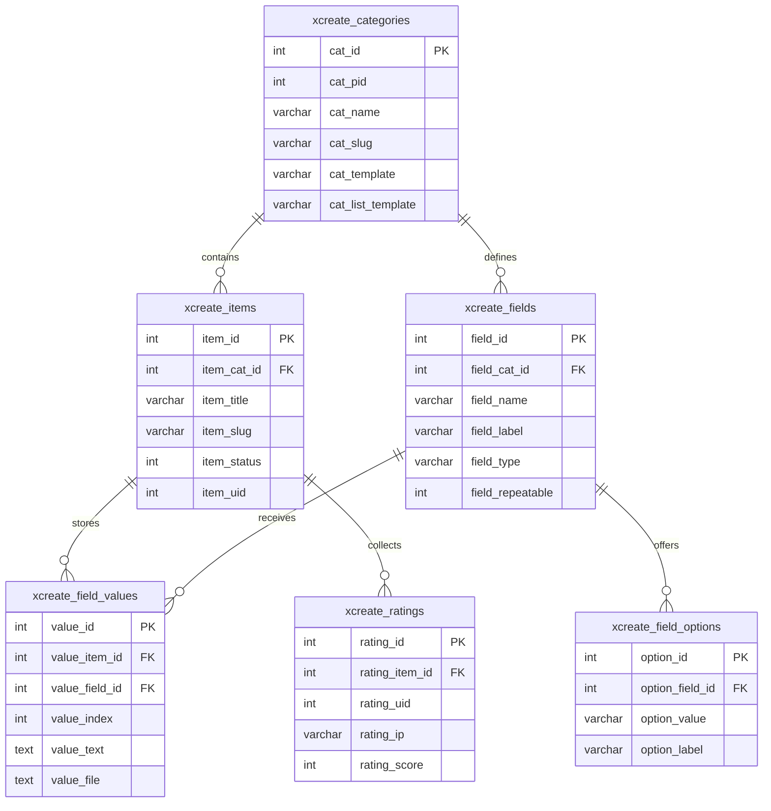
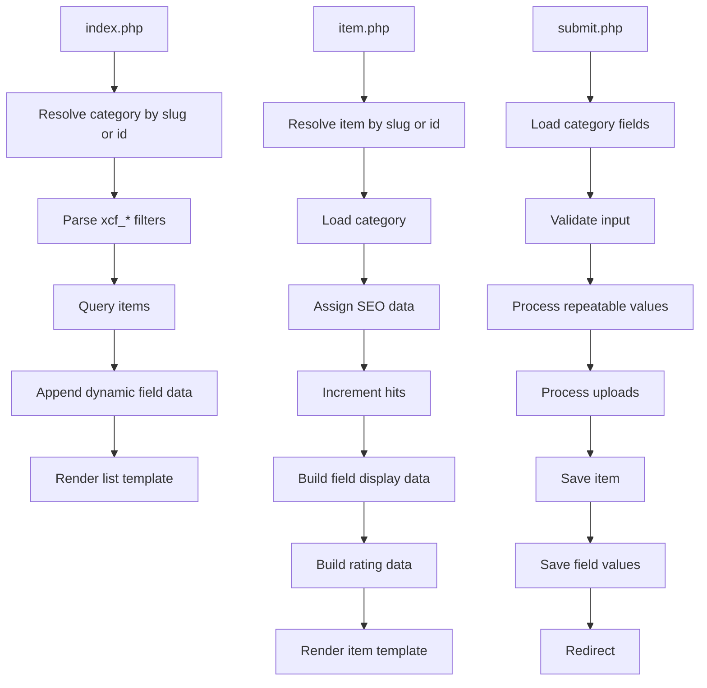
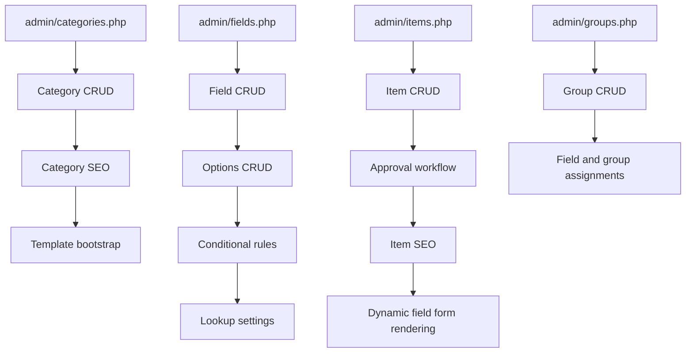

# Xcreate Diagrams

This document gives a compact schema and request-flow view of the module.

## 1. Schema diagram

## 2. Public request flow

## 3. Admin request flow

## 4. Rendering flow

## 5. Block flow

## 6. Files worth reading with the diagrams

- [sql/mysql.sql](/C:/wamp64/www/270test3/htdocs/modules/xcreate/sql/mysql.sql:1)
- [class/item.php](/C:/wamp64/www/270test3/htdocs/modules/xcreate/class/item.php:1)
- [class/field.php](/C:/wamp64/www/270test3/htdocs/modules/xcreate/class/field.php:1)
- [class/fields_helper.php](/C:/wamp64/www/270test3/htdocs/modules/xcreate/class/fields_helper.php:1)
- [index.php](/C:/wamp64/www/270test3/htdocs/modules/xcreate/index.php:1)
- [item.php](/C:/wamp64/www/270test3/htdocs/modules/xcreate/item.php:1)
- [submit.php](/C:/wamp64/www/270test3/htdocs/modules/xcreate/submit.php:1)
